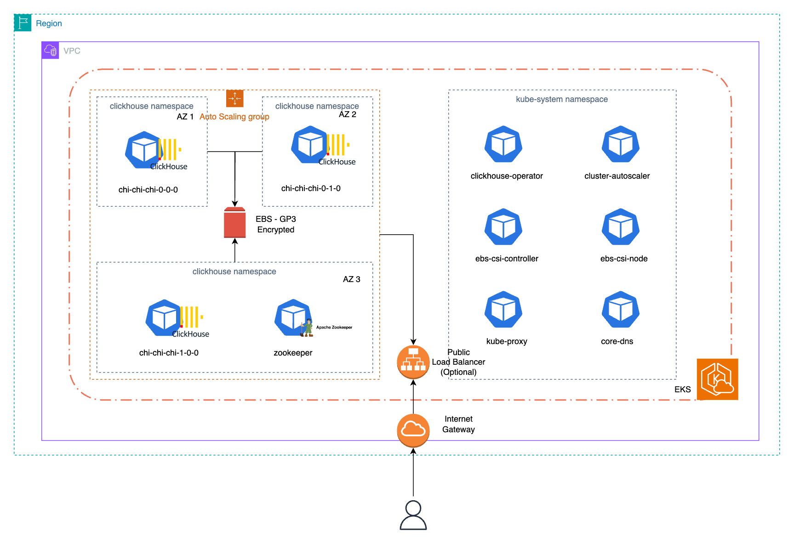

# Terraform Module for EKS ClickHouse Cluster

This Terraform module automates the deployment of a [ClickHouse](https://clickhouse.com) database cluster on [Amazon EKS](https://aws.amazon.com/eks/) (Elastic Kubernetes Service). It is designed to create and configure the necessary resources for a robust and scalable ClickHouse deployment.

The code is separated in different modules: one for the EKS cluster, one for the Altinity ClickHouse operator, and one for ClickHouse (and ClickHouse Keeper) cluster. Variables are used to customize the deployment, including AWS region, cluster name, node configurations, and networking settings.

## Components

This architecture is provides a scalable, secure, and efficient environment for running a ClickHouse database on Kubernetes within AWS EKS. The focus on autoscaling, storage management, and proper IAM configurations its suitability for enterprise-level deployments using the following resources:

- **EKS Cluster**: Utilizes AWS Elastic Kubernetes Service to manage Kubernetes clusters. Configuration specifies version, node groups, and IAM roles for cluster operations.

- **VPC and Networking**: Sets up a VPC with public and private subnets, internet gateway, and route tables for network isolation and internet access. Default behaviour will create a NAT gateway and locate the EKS cluster under private subnets. If the NAT gatewway is disabled, cluster's node will be automatically move to public subnets and the private subnets will be ommited or destroyed.

- **IAM Roles and Policies**: Defines roles and policies for EKS cluster, node groups, and service accounts, facilitating secure interaction with AWS services.

- **ClickHouse Deployment**:
  - **Operator**: Deploys ClickHouse and its operator using a the Altinity helm charts, with configurations for namespace, user, and password (among ohters).
  - **ClickHouse Keeper**: Configures a ClickHouse Keeper cluster for ClickHouse coordination (deployed in the same ClickHouse namespace).

- **Storage**:
  - **EBS CSI Driver**: Implements the Container Storage Interface (CSI) for EBS, enabling dynamic provisioning of block storage for stateful applications.
  - **Storage Classes**: Defines storage classes for gp3 encrypted EBS volumes, supporting dynamic volume provisioning.

- **Cluster Autoscaler**: Implements autoscaling for EKS node groups based on workload demands, ensuring efficient resource utilization.

- **Security**: Configures different service accounts with IAM roles for fine-grained access control to AWS services.

## Architecture:



- [VPC & Subnets](./vpc.md)
- [EKS Cluster & Node Groups](./eks.md)
- [K8S Autoscaler](./autoscaler.md)
- [EBS & CSI Driver](./ebs.md)
- [ClickHouse](./clickhouse.md)

## Prerequisites

- AWS Account with appropriate permissions
- Terraform installed (recommended `>= v1.5`)
- Basic knowledge of Kubernetes and AWS services

## Usage

```hcl
provider "aws" {
  # https://registry.terraform.io/providers/hashicorp/aws/latest/docs
}

locals {
  region = "us-east-1"
}

module "eks_clickhouse" {
  source  = "github.com/Altinity/terraform-aws-eks-clickhouse"

  install_clickhouse_operator = true
  install_clickhouse_cluster  = true

  # Set to true if you want to use a public load balancer (and expose ports to the public Internet)
  clickhouse_cluster_enable_loadbalancer = false

  eks_cluster_name = "clickhouse-cluster"
  eks_region       = local.region
  vpc_cidr         = "10.0.0.0/16"

  vpc_availability_zones = [
    "${local.region}a",
    "${local.region}b",
    "${local.region}c"
  ]
  vpc_private_cidr = [
    "10.0.1.0/24",
    "10.0.2.0/24",
    "10.0.3.0/24"
  ]
  vpc_public_cidr = [
    "10.0.101.0/24",
    "10.0.102.0/24",
    "10.0.103.0/24"
  ]
  eks_node_pools_config = {
    scaling_config = {
      desired_size = 2
      max_size     = 10
      min_size     = 0
    }

    disk_size      = 20
    instance_types = ["m5.large"]
  }

  eks_tags = {
    CreatedBy = "mr-robot"
  }
}
```

> ⚠️ The module will create a Node Pool for each combination of instance type and availability zones. For example, if you have 3 azs and 2 instance types, this module will create 6 different Node Pools.

👉 Check the [Terraform registry](https://registry.terraform.io/modules/Altinity/eks-clickhouse/aws/latest) for a complete Terraform specification for this module.

## AWS Labs Blueprint

This module is the consequence of a collaboration between [Altinity](https://altinity.com) and [AWS Labs](https://awslabs.github.io/data-on-eks/). It is part of a series of tutorials to aim people do fancy stuff with data on AWS EKS (using different technologies)

You can find the complete blueprint [here](#), which use most of the code provided in this repo as a terraform module.
