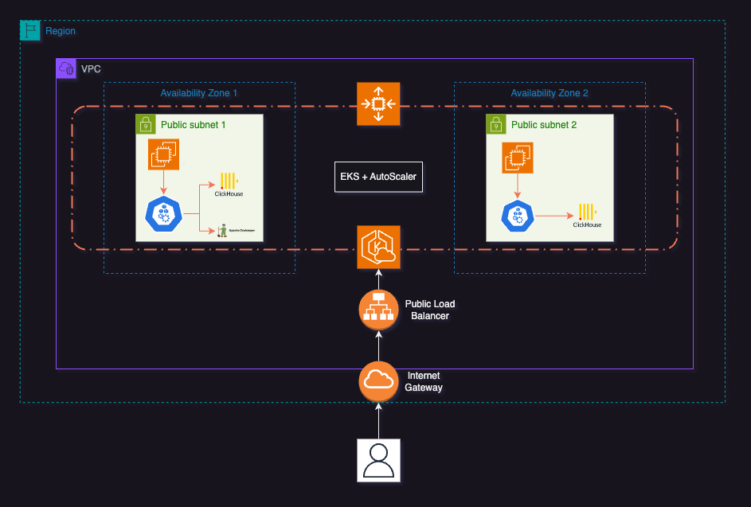

# ClickHouse Cluster on EKS with Terraform

With this pattern, you can deploy a ClickHouse cluster on AWS EKS (Elastic Kubernetes Service) with a single Terraform file. This module sets up the EKS cluster and node groups with all the tooling required to run ClickHouse clusters on Kubernetes.



The module uses opinionated defaults for the EKS cluster and node groups, including the EBS CSI driver, Kubernetes autoscaler, and IAM roles and policies. It also includes configurations for VPCs, public subnets, route tables, and internet gateways, which are essential for the network infrastructure of the EKS cluster.

The deployment experience is simple but flexible. You can customize several settings about the EKS cluster and node groups, such as scaling configurations, disk size, and instance types.

We recommend keeping the defaults if you are new to EKS and ClickHouse. However, if you are familiar with EKS and ClickHouse, feel free to use this template as a starting point and customize it to your needs.

> ⚠️ There are some configurations or resources that may not be considered "production-ready" depending your security guideliness. Use these examples with caution and as a starting point for your learning and development process.

## Components

This architecture provides a scalable, secure, and efficient environment for running a ClickHouse database on Kubernetes within AWS EKS. The focus on autoscaling, storage management, and proper IAM configurations ensures its suitability for enterprise-level deployments using the following resources:

- **EKS Cluster**: Utilizes AWS Elastic Kubernetes Service to manage Kubernetes clusters. Configuration specifies version, node groups, and IAM roles for cluster operations.

- **VPC and Networking**: Sets up a VPC with public and private subnets, NAT gateway, Internet gateway, and route tables for network isolation and internet access. Public subnets and an S3 VPC endpoint are created for external and internal communications, respectively.

  > The VPC configuration we've chosen is advisable for a real and productive environment. It strikes a good balance between simplicity and user-friendliness for getting started with ClickHouse, while still preserving fundamental security aspects. The main idea behind this setup is to generate a ClickHouse cluster with an optional public URL to which you can easily connect once the provisioning is complete.

- **IAM Roles and Policies**: Defines roles and policies for EKS cluster, node groups, and service accounts, facilitating secure interaction with AWS services.

- **ClickHouse Deployment**: This ClickHouse cluster, is designed for flexibility and high availability. It integrates with **ClickHouse Keeper** for cluster management and coordination, and allows external access with enhanced security. The cluster's architecture supports high availability with a shard and replica structure across multiple zones, ensuring fault tolerance. Storage is secured and performant, utilizing an encrypted gp3 class. The setups is performed using 3 different helm charts:
  - **Operator**: The operator facilitates the lifecycle of ClickHouse clusters, including scaling, backup, and recovery.
  - **Cluster**: Creates a ClickHouse cluster using a Altinity ClickHouse Operator, with configurations for namespace, user, and password.
  - **ClickHouseKeeper**: Set up a ClickHouse Keeper cluster for ClickHouse coordination to enhance ClickHouse clusters by managing configuration and ensuring consistency.

  > For more information about the Helm Charts, you can check the [kubernetes-blueprints-for-clickhouse](https://github.com/Altinity/kubernetes-blueprints-for-clickhouse) repository.


- **Storage**:  We opted for Amazon EBS (Elastic Block Store) for our cluster's storage due to its cost-effectiveness compared to other AWS storage options. EBS provides high performance, durability, and the flexibility to scale, making it ideal for database workloads like ClickHouse. It offers a cost-efficient solution for maintaining data integrity and availability.

  - **EBS CSI Driver**: Implements the Container Storage Interface (CSI) for EBS, enabling dynamic provisioning of block storage for stateful applications.
  - **Storage Classes**: Defines storage classes for gp3 encrypted EBS volumes, supporting dynamic volume provisioning.

- **Cluster Autoscaler**: Implements autoscaling for EKS node groups based on workload demands, ensuring efficient resource utilization.

  > Autoscaling is a critical feature for managing the resources of your EKS cluster. It automatically adjusts the number of nodes in a node group based on the resource requests and limits of the pods running on the nodes. This ensures that the cluster is right-sized for the current workload, optimizing costs and performance.

## Deploying the Solution

### Pre-requisites

- [kubectl](https://kubernetes.io/docs/tasks/tools/#kubectl)
- [aws cli](https://docs.aws.amazon.com/cli/latest/userguide/getting-started-install.html)
- [terraform](https://developer.hashicorp.com/terraform/tutorials/aws-get-started/install-cli)
- [git](https://git-scm.com/book/en/v2/Getting-Started-Installing-Git)
- [clickhouse client](https://clickhouse.com/docs/en/integrations/sql-clients/clickhouse-client-local)

### Setup

1. **Clone the repository**

```bash
git clone https://github.com/awslabs/data-on-eks.git
```

2. Navigate into the example directory and use `terraform` command to initialize Terraform and apply the changes.

```bash
cd data-on-eks/analytics/terraform/clickhouse-eks

# If you already have an AWS profile setup, you can skip this step
export AWS_ACCESS_KEY_ID="<key-id>"
export AWS_SECRET_ACCESS_KEY="<super-secret-key>"
export AWS_SESSION_TOKEN="<session-token>"

terraform init
terraform apply
```

> This will take a few minutes to complete. Once it's done, you will see the output of the `terraform apply` command, including the `kubeconfig` setup for the EKS cluster.

### Verify

Let's verify that the EKS cluster and ClickHouse deployment are running as expected.
```bash
aws eks describe-cluster --name clickhouse-cluster --region us-east-1
```

Verify that the EKS cluster is active and the nodes are ready.

```bash
# Use this command to setup the `kubeconfig` for the EKS cluster.
eval $(terraform output eks_configure_kubectl | tr -d '"')

# Get aws, autoscaler, ebs-csi, clickhouse operator and other k8s pods
kubectl get pods -n kube-system

# Get clickhouse and zookeeper  pods
kubectl get pods -n clickhouse
```

## Create your first ClickHouse table

Clickhouse uses a SQL-like language to interact with the database. You can use the `clickhouse-client` to connect to the database and create your first table.

### Connect to the ClickHouse cluster
Retrieve the ClickHouse cluster credentials and connect using the `clickhouse-client`.

```bash
# Get password and host from the terraform output
password=$(terraform  output clickhouse_cluster_password | tr -d '"')
host=$(terraform  output clickhouse_cluster_url | tr -d '"')

# Connect to the ClickHouse cluster using clickhouse-client
clickhouse client --host=$host --user=test --password=$password
```

### Create a database
Create a new database named `helloworld` if it doesn't already exist.

```sql
CREATE DATABASE IF NOT EXISTS helloworld
```

### Create a table
Define a new table `my_first_table` in the `helloworld` database, specifying its schema.
```sql
CREATE TABLE helloworld.my_first_table
(
    user_id UInt32,
    message String,
    timestamp DateTime,
    metric Float32
)
ENGINE = MergeTree()
PRIMARY KEY (user_id, timestamp)
```

### Add some data
Insert sample data into `my_first_table` demonstrating basic usage.

```sql
INSERT INTO helloworld.my_first_table (user_id, message, timestamp, metric) VALUES
    (101, 'Hello, ClickHouse!',                                 now(),       -1.0    ),
    (102, 'Insert a lot of rows per batch',                     yesterday(), 1.41421 ),
    (102, 'Sort your data based on your commonly-used queries', today(),     2.718   ),
    (101, 'Granules are the smallest chunks of data read',      now() + 5,   3.14159 )
```

### Query the data
Retrieve and display all records from `my_first_table`, ordered by `timestamp`.

```sql
SELECT *
FROM helloworld.my_first_table
ORDER BY timestamp
```

## Next Steps
- Implement Monitoring & Observability solutions for in-depth performance and health insights.
- Consider additional security measures, backup strategies, and disaster recovery plans.
- Investigate advanced networking configurations, focusing on the use of private subnets and NAT gateways to enhance security and control traffic flow within your EKS environment.

## Cleanup

When you are done with the ClickHouse cluster, you can remove it by running the `destroy` command. This will delete the EKS cluster and all the resources created by the Terraform script.

```bash
cd data-on-eks/analytics/terraform/clickhouse-eks && terraform destroy
```

## Altinity

If you are looking for a managed ClickHouse service, [Altinity](https://altinity.cloud) offers enterprise-grade support for ClickHouse, including optimized builds and consultancy services.

- [Altinity.Cloud](https://altinity.com/cloud-database/) - Run ClickHouse in our cloud or yours.
- [Altinity Support](https://altinity.com/support/) - Get Enterprise-class support for ClickHouse.
- [Slack](https://altinitydbworkspace.slack.com/join/shared_invite/zt-w6mpotc1-fTz9oYp0VM719DNye9UvrQ) - Talk directly with ClickHouse users and Altinity devs.
- [Contact us](https://hubs.la/Q020sH3Z0) - Contact Altinity with your questions or issues.